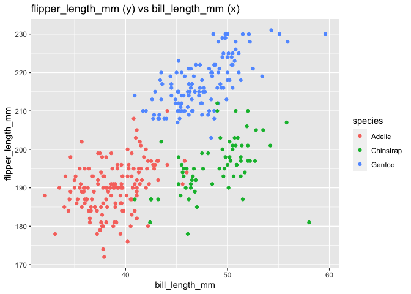

p8105_hw1_jy3269
================
Jingyi Yao
2022-09-17

#### Load packages

``` r
library(tidyverse)
library(palmerpenguins)
```

## Problem 1

#### Load the `penguins` data set from the `palmerpenguins` package

``` r
data("penguins", package = "palmerpenguins")   # load the penguins data set 
```

#### Description of the `Penguins`data set

1.  The `penguins` data set has 8 columns and 344 rows

2.  The column names of the data set are

    species, island, bill_length_mm, bill_depth_mm, flipper_length_mm,
    body_mass_g, sex, year

3.  The mean flipper length is 200.9152047

#### Scatter Plot

``` r
ggplot(penguins,aes(x = flipper_length_mm,y = bill_length_mm,colour = species)) + geom_point()
```

    ## Warning: Removed 2 rows containing missing values (geom_point).

<!-- -->

``` r
                                             # make a scatter plot

ggsave("scatter_plot_flipper_vs_bill.pdf")   # save the plot in pdf format
```

    ## Saving 7 x 5 in image

    ## Warning: Removed 2 rows containing missing values (geom_point).

## Problem 2

#### Create a dataframe

``` r
df_1 <- tibble(                  # use tibble() to create a dataframe named df_1
  norm_samp = rnorm(n = 10),     # sample from standard normal distribution
  logic_vec = norm_samp > 0,     # logical vector
  char_vec = letters[1:10],      # character vector of the first 10 English letters
  fac_vec = factor( c("male","female","transgender","male","male","transgender","female","female","female","female"))               # factor vector of 3 types of gender
)
 
df_1                             # show the created dataframe
```

    ## # A tibble: 10 × 4
    ##    norm_samp logic_vec char_vec fac_vec    
    ##        <dbl> <lgl>     <chr>    <fct>      
    ##  1    0.452  TRUE      a        male       
    ##  2    1.31   TRUE      b        female     
    ##  3   -0.624  FALSE     c        transgender
    ##  4   -0.0398 FALSE     d        male       
    ##  5   -0.949  FALSE     e        male       
    ##  6    0.646  TRUE      f        transgender
    ##  7    0.768  TRUE      g        female     
    ##  8   -0.992  FALSE     h        female     
    ##  9    1.27   TRUE      i        female     
    ## 10    0.539  TRUE      j        female

#### Caculate the mean of variables *Before* converting the types

``` r
print(sample_mean <- mean(pull(df_1,var=1)))  # mean of norm_samp in df_1
```

    ## [1] 0.2374337

``` r
print(logic_mean <- mean(pull(df_1,var=2)))   # mean of logic_vec in df_1
```

    ## [1] 0.6

``` r
print(char_mean <- mean(pull(df_1,var=3)))    # mean of char_vec in df_1
```

    ## Warning in mean.default(pull(df_1, var = 3)): argument is not numeric or
    ## logical: returning NA

    ## [1] NA

``` r
print(fac_mean <- mean(pull(df_1,var=4)))     # mean of fac_vec in df_1
```

    ## Warning in mean.default(pull(df_1, var = 4)): argument is not numeric or
    ## logical: returning NA

    ## [1] NA

#### Convert the types of variables

``` r
logic_vec_new <- as.numeric(pull(df_1,var=2))   # converted logical vector

char_vec_new <- as.numeric(pull(df_1,var=3))    # converted character vector

fac_vec_new <- as.numeric(pull(df_1,var=4))     # converted factor vector
```

#### Caculate the mean of variables *After* converting the types

``` r
print(logic_mean_new<-mean(logic_vec_new)) # mean of converted logical vector
```

    ## [1] 0.6

``` r
print(char_mean_new<-mean(char_vec_new))   # mean of converted character vector
```

    ## [1] NA

``` r
print(fac_mean_new<-mean(fac_vec_new))     # mean of converted factor vector
```

    ## [1] 1.7

After the `as.numeric()` conversion to the variables:

1.  TRUE, TRUE, FALSE, FALSE, FALSE, TRUE, TRUE, FALSE, TRUE, TRUE is
    turned into 1, 1, 0, 0, 0, 1, 1, 0, 1, 1,

    -   `TRUE` is given the value of `1`
    -   `FALSE` is given the value of `0`

2.  a, b, c, d, e, f, g, h, i, j is turned into NA, NA, NA, NA, NA, NA,
    NA, NA, NA, NA

    -   The warning shows that the characters cannot be transformed into
        numbers We only get NAs in the new vector

3.  male, female, transgender, male, male, transgender, female, female,
    female, female is turned into 2, 1, 3, 2, 2, 3, 1, 1, 1, 1

    -   `female` is given the value of `1`
    -   `male` is given the value of `2`
    -   `transgender` is given the value of `3`
